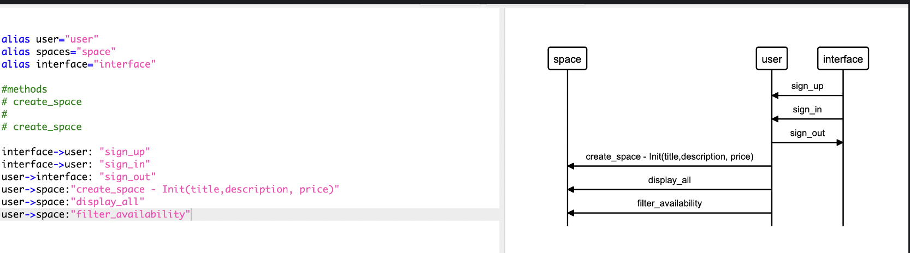

MakersBnB
=================
Challenge:
 -------
Builld a web application clone of AirBnB that allows users to list spaces they have available, and to hire spaces for the night.

<p>&nbsp;</p>

## Tech Stack
Frontend
* HTML
* CSS

Backend
* Ruby
* Sinatra web framework
* PostgreSQL

Testing
* RSpec
* Capybara 
<p>&nbsp;</p>


### Project Setup
```
git clone https://github.com/merrynhr/makers_bnb.git

gem install bundle

bundle
```
### Database Setup

in your terminal
```
psql
CREATE DATABASE bnb_test;
CREATE DATABASE bnb;
```
for each database: 
```
\c <databasename>
```
spaces table -

```
CREATE TABLE spaces (
    id SERIAL PRIMARY KEY
   ,name VARCHAR(50)
   ,description VARCHAR(250)
   ,price VARCHAR(40)
);

ALTER TABLE spaces

ADD COLUMN date_avail DATE;
```
user table -
```
CREATE TABLE users (
  id SERIAL PRIMARY KEY,
  name VARCHAR(20),
  email VARCHAR(40),
  password VARCHAR(60)
);
ALTER TABLE users ALTER COLUMN password TYPE VARCHAR(60);
```

### Run App

```
rackup
```
and visit:

localhost:9292

### Run Tests
```
rspec
```
## User Interface 


### Project Management

<a href="https://trello.com/b/0tNUI2iX/toomanymichaels">Trello board</a>


### Outline of MVP

* sign up
* sign in/sign out
* Add a new space
* user can request to rent a space
* list all spaces
* filter dates in list of spaces
* Basic interface

<p>&nbsp;</p>

### User Stories
```
As a user
So that i can use MakersBnb
I would like to be able to sign up

As a user
So that i can use MakersBnb
I would like to be able to sign in/out

As a property-owner
so that i can rent out my place
i would like to be able to list a property 

As a user
so that i can rent a place
I would like to see a list of all the spaces

As a renter,
So that I can hire a property,
I want to be able to request to stay at a property

As a property-owner,
So that I can specify the dates my property is available,
I want to be able to offer a range of dates.
```


### Domain Model




## Built by:

* Craig Eaton
* Merryn Hurley
* Ashley Slaney 
* Mikey Roberts
* Michael Maiga
* Mike McLoughlin


